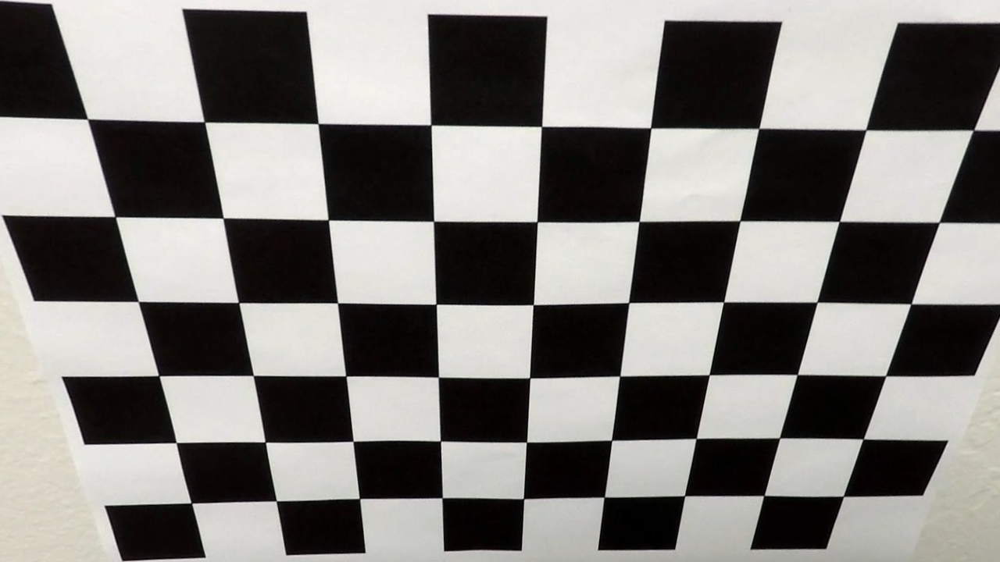
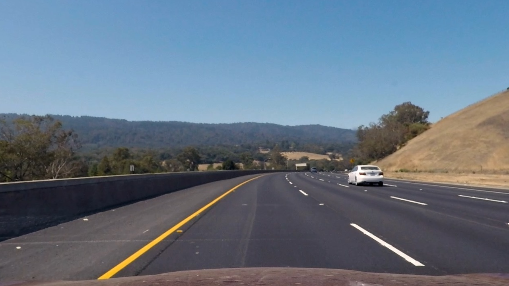
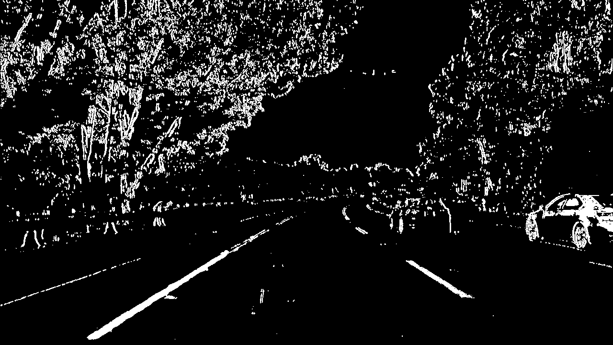
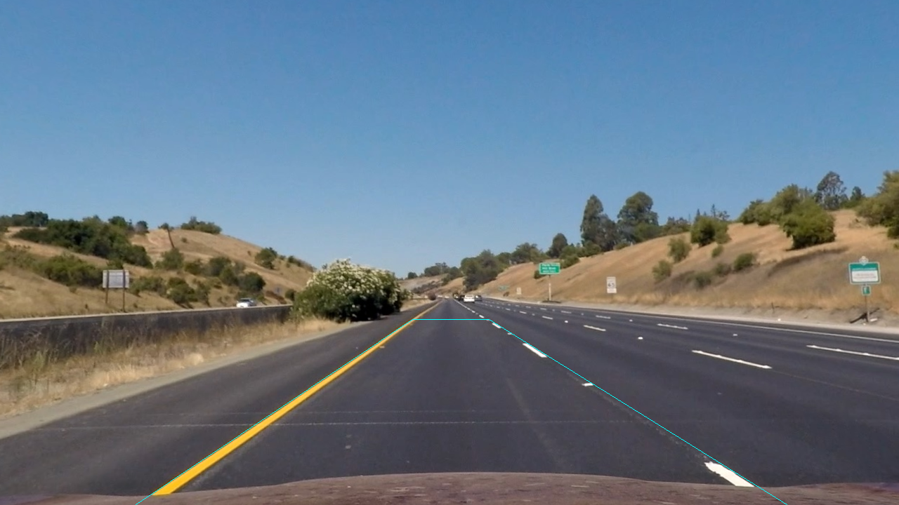
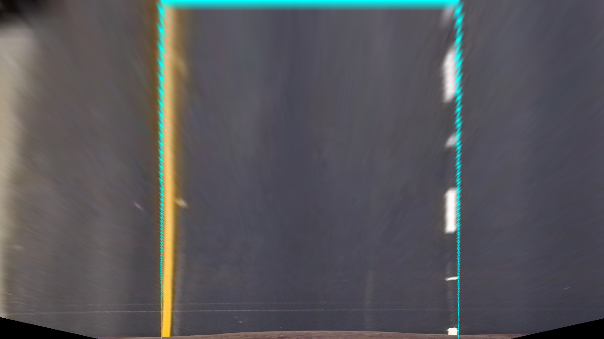
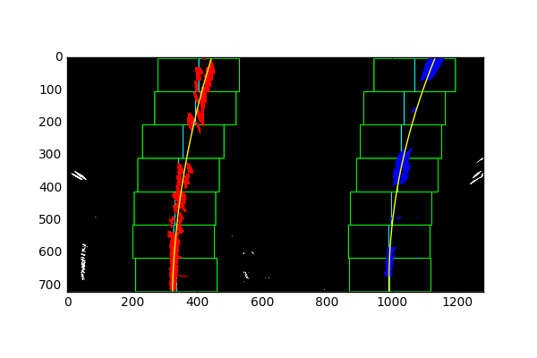
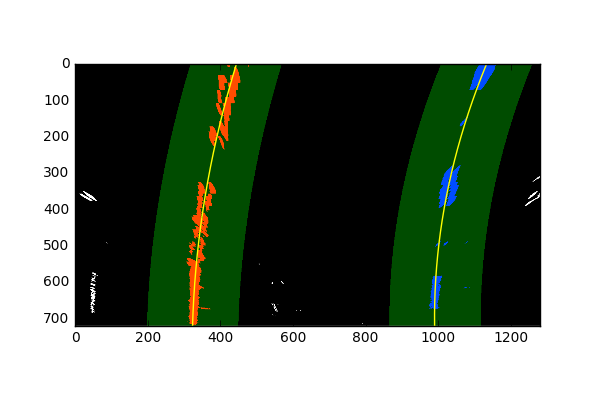
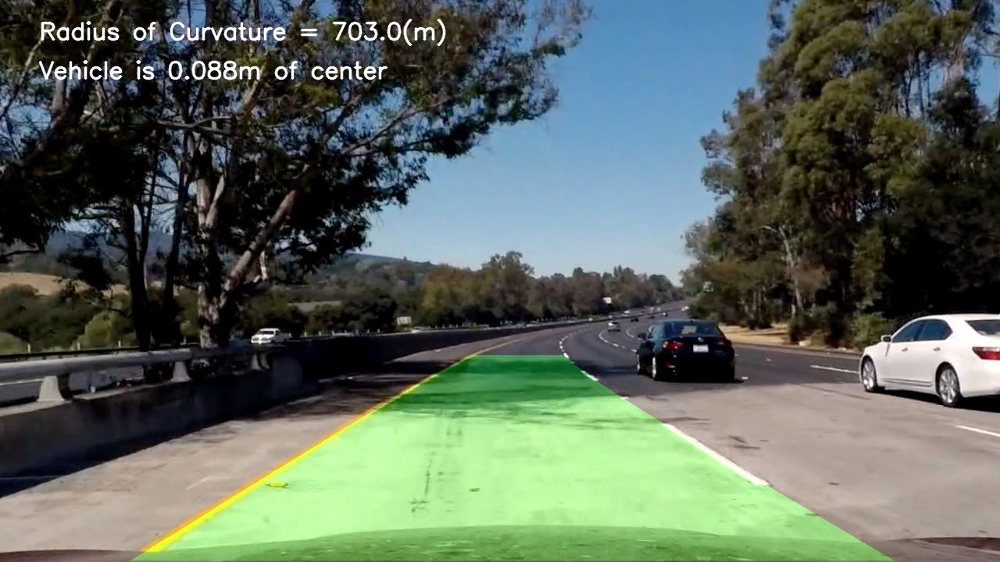

##Writeup Template
###You can use this file as a template for your writeup if you want to submit it as a markdown file, but feel free to use some other method and submit a pdf if you prefer.

---

**Advanced Lane Finding Project**

The goals / steps of this project are the following:

* Compute the camera calibration matrix and distortion coefficients given a set of chessboard images.
* Apply a distortion correction to raw images.
* Use color transforms, gradients, etc., to create a thresholded binary image.
* Apply a perspective transform to rectify binary image ("birds-eye view").
* Detect lane pixels and fit to find the lane boundary.
* Determine the curvature of the lane and vehicle position with respect to center.
* Warp the detected lane boundaries back onto the original image.
* Output visual display of the lane boundaries and numerical estimation of lane curvature and vehicle position.


## [Rubric](https://review.udacity.com/#!/rubrics/571/view) Points
###Here I will consider the rubric points individually and describe how I addressed each point in my implementation.  

---
###Writeup / README

####1. Provide a Writeup / README that includes all the rubric points and how you addressed each one.  You can submit your writeup as markdown or pdf.  [Here](https://github.com/udacity/CarND-Advanced-Lane-Lines/blob/master/writeup_template.md) is a template writeup for this project you can use as a guide and a starting point.  

You're reading it!
###Camera Calibration

####1. Briefly state how you computed the camera matrix and distortion coefficients. Provide an example of a distortion corrected calibration image.

The code for this step is contained in the first code cell of the IPython notebook located in "./Advanced-Lane-Finding.ipynb"   

I start by preparing "object points", which will be the (x, y, z) coordinates of the chessboard corners in the world. Here I am assuming the chessboard is fixed on the (x, y) plane at z=0, such that the object points are the same for each calibration image.  Thus, `objp` is just a replicated array of coordinates, and `objpoints` will be appended with a copy of it every time I successfully detect all chessboard corners in a test image.  `imgpoints` will be appended with the (x, y) pixel position of each of the corners in the image plane with each successful chessboard detection.  

I then used the output `objpoints` and `imgpoints` to compute the camera calibration and distortion coefficients using the `cv2.calibrateCamera()` function.  I applied this distortion correction to the test image using the `cv2.undistort()` function and obtained this result:

 Original       | Undistorted   
----------------|--------------
 | 

I saved the camera matrix and distortion coefficients to a pickle file to avoid having to calculate them each time the detection pipeline is run.

###Pipeline (single images)

####1. Provide an example of a distortion-corrected image.
In order to correct the distortion of road images, I use the function `cv2.undistort()` with the distortion coefficients and the camera matrix that were calculated and saved during the camera calibration step. That function takes an input image and returns the undistorted image like this:

####2. Describe how (and identify where in your code) you used color transforms, gradients or other methods to create a thresholded binary image.  Provide an example of a binary image result.
I used a combination of color channel and gradient thresholds to generate a binary image. I converted the RGB image to the HLS space and used the L (lightness) channel to compute the gradients in the x direction. I applied a threshold to that gradient as to the the S (saturation) channel and L (lightness) channel. These thresholds where combined to produce a binary image (thresholding steps in the function `binary_mask()` in `Advanced-Lane-Lines.ipynb`). To remove some noise I apply a filter with a kernel to compute 8-connectivity, to detect pixels with less than 4 neighbors, which I then remove.
Here's an example of my output for this step.



####3. Describe how (and identify where in your code) you performed a perspective transform and provide an example of a transformed image.

The code for my perspective transform includes a function called `birdseye()`, which appears in the 8th code cell of the IPython notebook `Advanced-Lane-Lines.ipynb`.  The `birdseye()` function takes as inputs an image (`image`), and uses the constants source (`SRC`) and destination (`DST`) points. I by picked SRC points from one images with straight lane lines (`straight_lines1.jpg`) and mapped this to a rectangular DST.  I hardcoded the source and destination points in the following manner:

```
SRC = np.float32([
    (192, 720),
    (587, 455),
    (696, 455),
    (1121, 720)])

DST = np.float32([
    (SRC[0][0] + 150, 720),
    (SRC[0][0] + 150, 0),
    (SRC[-1][0] - 150, 0),
    (SRC[-1][0] - 150, 720)])

```
This resulted in the following source and destination points:

| Source        | Destination   |
|:-------------:|:-------------:|
| 192, 720      | 342, 720      |
| 587, 455      | 342, 0        |
| 1121, 720     | 971, 0        |
| 696, 720      | 971, 720      |

I verified that my perspective transform was working as expected by drawing the `src` and `dst` points onto a test image and its warped counterpart to verify that the lines appear parallel in the warped image.

Original       | Warped   
---------------|--------------
 | 

####4. Describe how (and identify where in your code) you identified lane-line pixels and fit their positions with a polynomial?
The first step is to search the image for lane-line pixels using `hist_lines_detector()` in the 12th code cell of `Advanced-Lane-Lines.ipynb`. This function first computes a histogram of the bottom half of the thresholded warped image (`full_histogram_search()`), to detect the base points for the sliding window search for both the left and right lines (`sliding_window_search()`). The window search returns the identified lane-line pixels for each line. Through this search the pixel positions are passed to a Line object for each line (`update()` function, in the 16th code cell), which fits the them to a second order polynomial.

The following image shows an example of sliding window search.


The sliding window method is used for the first frame or for cases where  lanes are ‘lost’ (this is, a line doesn't meet the criteria of line position and rate of change).
When the last lines were valid, a local search is performed., which looks at a a window around the previously fitted (averaged) polynomial for the line. This is done through the function `local_lines_detector()` in the 14th code cell.

The following image shows an example of a local search.


Both methods, sliding window search and localized search round a polynomial, filter out points at the edges of the image. Not doing so, makes the algorithm to catastrophically fail (very bad fitted lines) in many frames.

Each Line object (right and left) stores the fit for the last 8 frames and calculates the average fit, and average radius of curvature and offset from the position of the vehicle (center of the image). The Line objects only update their fit if the line for the current frame meets the rate of change criteria.

A further improvement would detect if lanes are parallel to discard or accept them.

####5. Describe how (and identify where in your code) you calculated the radius of curvature of the lane and the position of the vehicle with respect to center.

I did this in the 11th code block, with the function `get_radius_of_curvature()`. This function takes the the fit points of each line and computes a new fit correcting for scale in x and y, so the radius is returned meters. I have considered that horizontally 700 pixels represent 3.7 pixels, and vertically 720 pixels represent 30 meters.

####6. Provide an example image of your result plotted back down onto the road such that the lane area is identified clearly.

I implemented this step in the 20th code blocking the function `process_frame()`. This function implements the whole pipeline for a frame and calls `draw_lane_overlay()` to draw the lane and unwarp it onto the undistorted frame.  Here is an example of my result on a test image:



---

###Pipeline (video)

####1. Provide a link to your final video output.  Your pipeline should perform reasonably well on the entire project video (wobbly lines are ok but no catastrophic failures that would cause the car to drive off the road!).

The video result is [./project_video_out.mp4](./project_video_out.mp4)

---

###Discussion

####1. Briefly discuss any problems / issues you faced in your implementation of this project.  Where will your pipeline likely fail?  What could you do to make it more robust?

The most difficult part of the project was implementing the line detection using the sliding windows technique and localized search. Even though I had to reuse code from the lessons, it was not an easy task improve upon it and tune all possible parameters in the pipeline. The biggest improvement I got was as simple filtering out points from the margins of the image.

My current pipeline does not work well on some because some the line fits get bad when the pipeline does not find any pixels for one of the lane lines or detects too many noise. I had guessed that an improvement on the thresholding and filtering step would solve partially the detection problem. 

As I mentioned earlier, a further improvement would detect if lanes are parallel to discard or accept them based on that. However, this does not solve the bad detection problem if it happens during several frames. Maybe some of the parameters should in the pipeline should be adaptive based on the current quality of detected fits.
